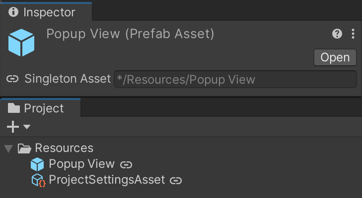

# One-Asset
> Solution for smart asset loading

A set of classes and editor UI improvements aimed to improve workflows that require asset loading.

**Package contains**:
- `OneAssetLoader` Loads assets with options from `AssetLoadOptions`
- Abstract class that can be inherited to get a singleton behaviour
  - `OneGameObject<T>`
  - `OneScriptableObject<T>`
- Customize a singleton implementation with `AssetLoadOptions` like:
  - Load instance from a prefab or `ScriptableObject` asset
  - Create an asset automatically if it doesn't exist already
- Extended editor UI for singleton assets:
  - Custom icons and tooltips in the project browser 
  - Asset load path field in the inspector header



## `OneAssetLoader`

**Example usage**
```csharp
var loadPaths = new[]
{
    "Assets/Resources/OneAssetSamples1/SampleAsset.asset",
    "Assets/Resources/LegacyPath/SampleAsset.asset"
};
var loadOptions = new AssetLoadOptions(loadPaths)
{
    // Enables a system that will create scriptable object file if it cannot be loaded from loadPaths.
    // Asset will always be created at the first path provided.
    // Works only in editor
    CreateAssetIfMissing = true,

    // If set to true a exception will be thrown when `OneAssetLoader` wont find asset at any of the provided paths
    // if set to false the `OneAssetLoader` will return a null 
    AssetIsMandatory = true,

    // Use the `UnityEditorInternal.InternalEditorUtility.LoadSerializedFileAndForget` as a fallback load option.
    // Use with caution!
    // Works only in editor
    LoadAndForget = true
};
var asset = OneAssetLoader.Load<SampleScriptableObject>(loadOptions);
```

## Loading assets from InitializeOnLoad callbacks
Certain asset operations are unsafe to perform in `InitializeOnLoad` callbacks. Unity documentation states that:
> Asset operations such as asset loading should be avoided in InitializeOnLoad methods. InitializeOnLoad methods are called before asset importing is completed and therefore the asset loading can fail resulting in a null object.

Generally it is better to avoid loading assets in `InitializeOnLoad` callbacks. However, if you really need to do it, you can use the `OneAssetLoader` with the `AssetLoadOptions.LoadAndForget` option set to `true`. This will use the `UnityEditorInternal.InternalEditorUtility.LoadSerializedFileAndForget` as a fallback load option. This loading option has side effects, use with caution! Side effect of loading asset with this method is that the loaded object is not treated as an asset by `AssetDatabase`, to preserve any changes to the loaded object you must save it with `InternalEditorUtility.SaveToSerializedFileAndForget` method.

## UnityEngine.Object and a Singleton pattern (Disclaimer)

By definition, a singleton is a class that:
- Has only one instance
- Provides a global (static) access to this instance


Despite the "singleton" term used throughout this package it may be beneficial not to associate this implementation with the standard singleton pattern.
This is for the reason that the `UnityEngine.Object` (base class of `MonoBehaviour` and `ScriptableObject`) allows for the creation and destruction of any object, at any time, from any place.
That means the following is possible and legal:
```c#
// Destroy a singeton
var singletonInstance = MySingleton.Instance;
UnityEngine.Object.Destroy(singletonInstance);

// Create a instance of a singleton class outise it
var i = ScriptableObject.CreateInstance<MySingleton>();
```
> For more details on exact behavior of singleton loading look at the XML documentation and tests.
> **See**: _OneScriptableObjectTests.cs_ and _OneAssetLoader.cs_ 

## `OneGameObject<T>`

`MonoBehaviour` Singleton implementation.
Takes into account some common problems of many singleton implementations that are out there.

Example:
```c#
[LoadFromAsset("Resources/Popup View.prefab")]
public class PopupView : OneGameObject<PopupView> { }
void UseExample()
{
    // Calling `PopupView.Instance` will load a prefab from */Resources/Popup View.prefab
    var obj = PopupView.Instance;
}
```

## `OneScriptableObject<T>`

`ScriptableObject` Singleton implementation.

Optional features:
- Create a [SettingsProvider](https://docs.unity3d.com/ScriptReference/SettingsProvider.html) just by adding `SettingsProviderAttribute` and `LoadFromAssetAttribute`


Example:
```c#
// LoadFromAssetAttribute will make the `SuperSdkSettings.Instance` load the scriptable object from
// resources path: "*Resources/Super SDK Settings"
// `CreateAssetIfMissing` turns on a system that will create scriptable object file at specific path
// if it cannot be loaded from path specified in `LoadFromAsset` attribute
// in this example it will create asset with path: "Assets/Settings/Resources/Super SDK Settings"
[LoadFromAsset("Assets/Settings/Resources/Super SDK Settings.asset", CreateAssetIfMissing = true)]
// The `SettingsProviderAsset` will create a new UI settings tab with name "Super SDK" in the Project Settings window
// where users can edit this asset
[SettingsProviderAsset("Project/Super SDK")]
public class SuperSdkSettings : OneScriptableObject<SuperSdkSettings>
{
    public string AppKey;
}
```

## Samples
Import samples from [Package Manager Window](https://docs.unity3d.com/Manual/upm-ui-details.html)

## Embedding this code in a package
To avoid collisions with other packages with this code:
- Make sure you delete the .meta files- use different guids for the scripts.
- Change the assembly names in assembly definition files and namespaces